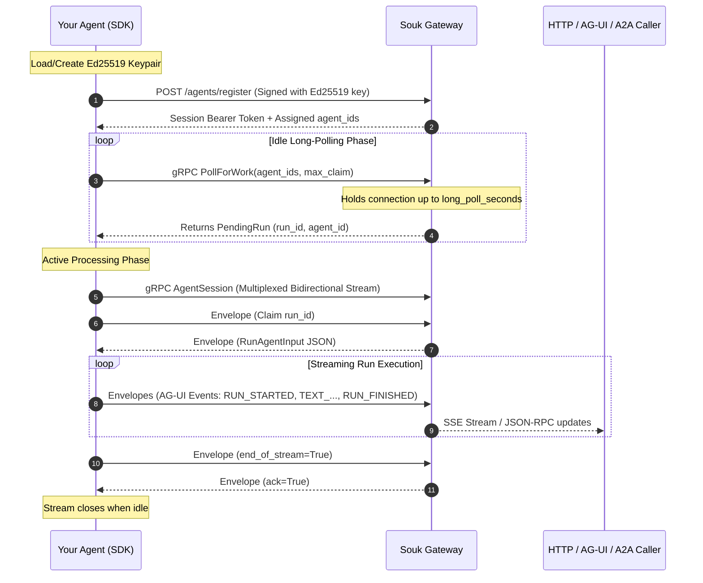

# souk-agent-sdk 🔌⚡

[](https://python.org)
[](../proto/souk.proto)
[](../LICENSE)

> **The Official Python Agent Provider SDK for Agent Souk.**  
> Effortlessly make any local, firewall-bound, or edge AI agent reachably exposed over **AG-UI** (human streaming) and **A2A** (agent-to-agent JSON-RPC) — **with zero inbound ports, no public IP, and no network configuration.**

This document is the pitch and the quick start. For the situations that
come up once your agent is actually running — multi-agent delegation
topologies (verified against a real LLM), session continuity, why
cancellation doesn't always work, and a few other things worth knowing
before they surprise you — see
**[docs/agent-provider-guide.md](../docs/agent-provider-guide.md)**.

---

## 💡 Key Concept: Your Agent Already Qualifies

`souk-agent-sdk` provides an outbound-only communication harness around your existing agent code. You don't need to rewrite your agent or adopt a proprietary framework.

If your agent already emits AG-UI-compatible event streams (or can format JSON event dicts), plugging it into Souk requires **writing just one streaming generator function**:

```python
RunStream = Callable[[dict[str, Any]], AsyncIterator[dict[str, Any]]]
```

The SDK handles all background network complexities: **Ed25519 keypair identity, gRPC long-polling, multiplexed streaming, backpressure, reconnection, thread state, and cancellation.**

```
┌───────────────────────────────────────────────┐
│              Souk Gateway Server              │
└───────────────────────▲───────────────────────┘
                        │ Outbound gRPC Stream
┌───────────────────────┴───────────────────────┐
│            souk_agent_sdk Client              │
│  - Ed25519 Identity & HMAC Token Refresh      │
│  - Long-Poll Work Discovery & gRPC Session    │
│  - Task Concurrency Throttling & Cancel Race  │
├───────────────────────────────────────────────┤
│            Your Agent Logic (run_stream)      │
│  (Pydantic-AI / LangGraph / Custom LLM Loop)  │
└───────────────────────────────────────────────┘
```

---

## ⚡ 30-Second Quick Start

### 1. Installation

Not published to PyPI — this lives in the AgentSouk monorepo and is meant
to be depended on as a local path (see `providers/pydantic-ai-agent` or
`agent-template` for real examples):

```toml
# your pyproject.toml
[project]
dependencies = ["souk-agent-sdk"]

[tool.uv.sources]
souk-agent-sdk = { path = "../path/to/AgentSouk/souk-agent-sdk" }
```

```bash
uv sync
```

### 2. Minimal Reference Provider

```python
import asyncio
from collections.abc import AsyncIterator
from typing import Any
from souk_agent_sdk import AgentHandle, SoukAgentClient

# 1. Define your agent stream handler (AG-UI event format)
async def my_agent_stream(run_input: dict[str, Any]) -> AsyncIterator[dict[str, Any]]:
    thread_id = run_input.get("threadId", "")
    run_id = run_input.get("runId", "")
    
    # Emit RUN_STARTED
    yield {"type": "RUN_STARTED", "threadId": thread_id, "runId": run_id}
    
    # Emit text content chunks
    msg_id = "msg_001"
    yield {"type": "TEXT_MESSAGE_START", "messageId": msg_id, "role": "assistant"}
    yield {"type": "TEXT_MESSAGE_CONTENT", "messageId": msg_id, "delta": "Hello from my local agent!"}
    yield {"type": "TEXT_MESSAGE_END", "messageId": msg_id}
    
    # Emit RUN_FINISHED
    yield {"type": "RUN_FINISHED", "threadId": thread_id, "runId": run_id}

# 2. Attach handle & start persistent outbound runner
async def main():
    handle = AgentHandle(
        name="echo-agent",
        description="A minimal reference agent running locally",
        run_stream=my_agent_stream,
    )
    
    client = SoukAgentClient(
        souk_http_url="http://localhost:8000",
        souk_grpc_url="localhost:50051",
        agents=[handle],
        max_concurrent_runs=10,  # Throttling limit
    )
    
    await client.run_forever()

if __name__ == "__main__":
    asyncio.run(main())
```

---

## 🌟 Core SDK Capabilities

| Capability | What `souk-agent-sdk` Handles Automatically |
|---|---|
| 🔐 **Self-Sovereign Identity** | Automatically generates & manages persistent **Ed25519 keypair** (`souk_identity.key`). Signs registration payloads to guarantee cryptographic ownership of assigned `agent_id`. |
| 🔄 **Automatic Reconnection & Token Refresh** | Re-registers on disconnects and seamlessly refreshes HMAC session bearer tokens without dropping queued tasks or interrupting run loops. |
| ⚡ **Smart Connection Lifecycle** | Holds no open stream when idle (only periodic lightweight long-poll `PollForWork`). Opens multiplexed gRPC `AgentSession` on-demand when work is queued. |
| ⛔ **Task Preemption & Cancellation** | Races inbound Souk cancellation frames against `run_stream` and immediately propagates `asyncio.CancelledError` into in-flight LLM/tool calls. |
| 🎛️ **Concurrency Throttling** | `max_concurrent_runs=N` prevents GPU/LLM rate-limit saturation by letting Souk queue surplus work server-side. |
| ⏸️ **Human-in-the-Loop (HITL)** | Intercepts AG-UI native `interrupt` outcomes to pause runs resumbably (`status='input-required'`). |
| 🔗 **A2A Delegation & Actor Chains** | `a2a_client.call_agent_streaming` simplifies sub-agent calls while signing multi-hop EdDSA JWT `ActorChain` provenance. |
| 🔑 **Keep-Your-Own-Key (KYOK)** *(experimental)* | `KyokSigningAuth` simplifies signature generation for caller-funded LLM completions over `/kyok/v1`. See `tests/test_kyok_auth.py` for its coverage; still in-memory only, no recovery if Souk or the provider restarts mid-relay. See [`docs/keep-your-own-key.md`](../docs/keep-your-own-key.md). |

---

## 🏛️ Connection & Lifecycle Architecture



---

## 📜 Event Protocol Specification

Every `run_stream` generator must yield events adhering to AG-UI specifications:

### 1. Minimal Event Sequence
1. `RUN_STARTED`: `{"type": "RUN_STARTED", "threadId": "...", "runId": "..."}`
2. **Content Events**: Zero or more `TEXT_MESSAGE_START` ➔ `TEXT_MESSAGE_CONTENT` ➔ `TEXT_MESSAGE_END`.
3. **Terminal Event** (Exactly one):
   - **Success**: `{"type": "RUN_FINISHED", "threadId": "...", "runId": "..."}`
   - **Error**: `{"type": "RUN_ERROR", "message": "Failure explanation"}`
   - **Interrupt (HITL Pause)**: `{"type": "RUN_FINISHED", "outcome": {"type": "interrupt", "interrupts": [...]}}`

---

## 🤝 Advanced Delegation (Agent-to-Agent)

An agent can delegate sub-tasks to other agents registered on Souk using `a2a_client`:

```python
from souk_agent_sdk.a2a_client import call_agent_streaming
from souk_agent_sdk.identity import extend_actor_chain, new_actor_chain

# Delegate streaming task to sub-agent
async for update in call_agent_streaming(
    a2a_url="http://localhost:8000/a2a/translator/rpc",
    message={"role": "user", "parts": [{"type": "text", "text": "Bonjour"}]},
    reference_task_ids=[current_run_id],  # Lineage tracking
    actor_chain=actor_chain,               # Multi-hop identity chain
):
    print("Sub-agent update:", update)
```

---

## 🛠️ Security & Identity Rules

> [!IMPORTANT]
> **Identity Key Persistence**
> The provider's identity is defined by its **Ed25519 keypair** (`souk_identity.key`).
> - Re-registering with the same key maintains ownership of assigned `agent_ids`.
> - If `souk_identity.key` is lost, Souk will treat new registrations under the same display name as a *new, separate identity* and issue fresh `agent_id`s.
> - **Always back up `souk_identity.key` in production environments!**

---

## 📁 Reference Implementations

- **[`/agent-template`](../agent-template)**: The minimal reference implementation (no LLM required). Start here to build a custom provider.
- **[`providers/pydantic-ai-agent`](../providers/pydantic-ai-agent)**: Full-featured production provider using [Pydantic-AI](https://ai.pydantic.dev), MCP tools, sub-agent delegation, and KYOK support *(experimental — see above)*.

---

## 🤝 Contributing & License

For development setup and contribution guidelines, see [CONTRIBUTING.md](../CONTRIBUTING.md).

**License**: [Apache 2.0](../LICENSE)
